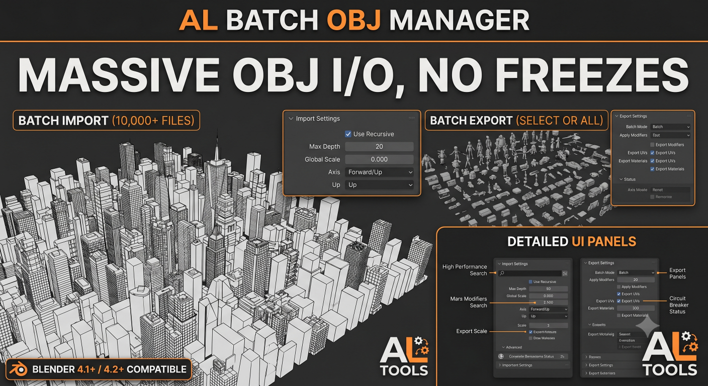

[**English**](./README.md) | [**中文**](./README_ZH.md)

---

# Usage

A Blender 4.x add-on designed for batch importing and exporting OBJ models. During the export process, each object is strictly exported as an individual, standalone file.

<video src="./README.assets/al_batch_obj_manager_usage_v1.mp4" controls=""></video>

 

## Batch Import

1. Install and activate the add-on **AL Batch OBJ Manager**.

2. Navigate to the directory containing your `.obj` models, configure the desired parameters, and click **Batch Import OBJ**. The parameter definitions are as follows:
   * **Recursive**: Enables recursive searching of subdirectories. If unchecked, the add-on will only import `.obj` models located in the current directory, ignoring all subdirectories. When checked, you can utilize the **Max Depth** parameter to restrict the maximum recursion level. Setting **Max Depth** to `-1` enables infinite recursion, meaning the add-on will traverse the entire directory tree regardless of depth to locate `.obj` files.
   * **Transform, Forward Axis, Up Axis, Options**: These parameters are identical to Blender's native single OBJ import settings. Configure them according to your source data specifications and expected viewport orientation.

3. The imported models will appear in the viewport as shown below (Note: The add-on will not alter your current viewport shading mode).

 

## Batch Export

1. Access the Batch Export function from the menu.

2. Configure the export parameters (The add-on guarantees that every single object will be exported as an independent `.obj` file). The parameter definitions are as follows:
   * **Export Range**: Toggles the scope of the export between exporting **All Visible** models in the scene or restricting the export to **Selected** models only.
   * **Transform, Geometry, Materials**: These parameters mirror Blender's standard single OBJ export settings. Adjust them as required for your downstream pipeline.

3. The resulting output directory containing the exported files will look like this:

