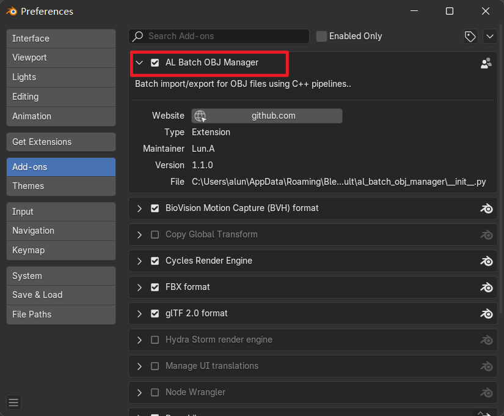
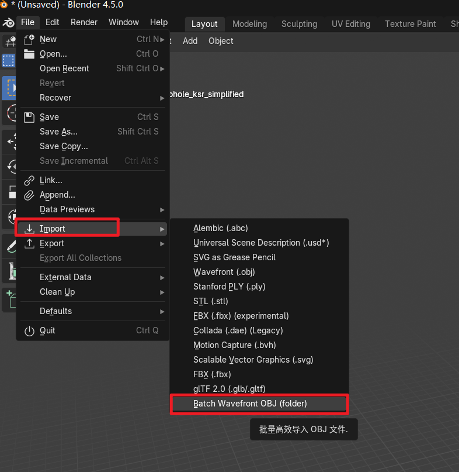
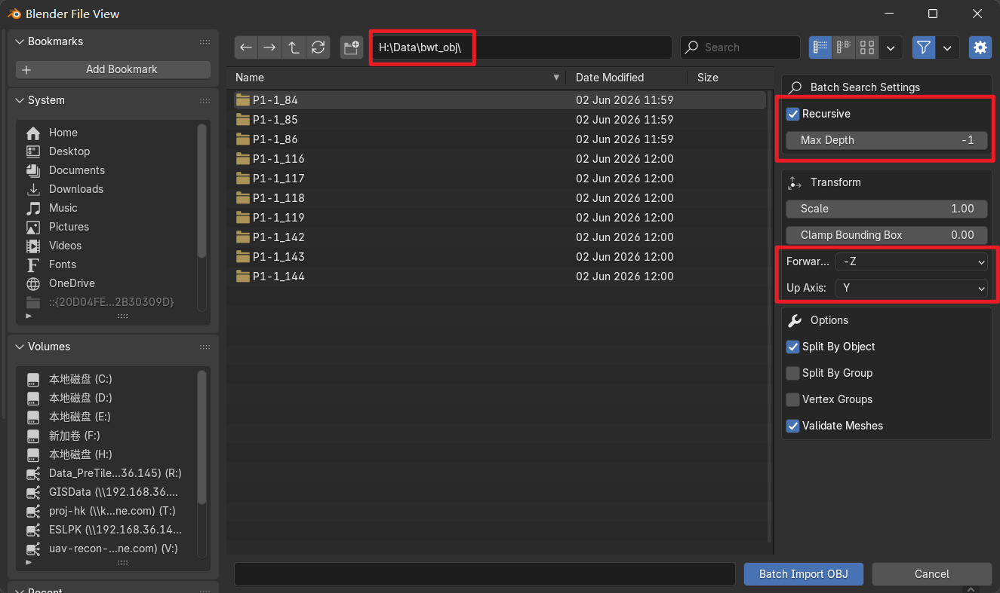
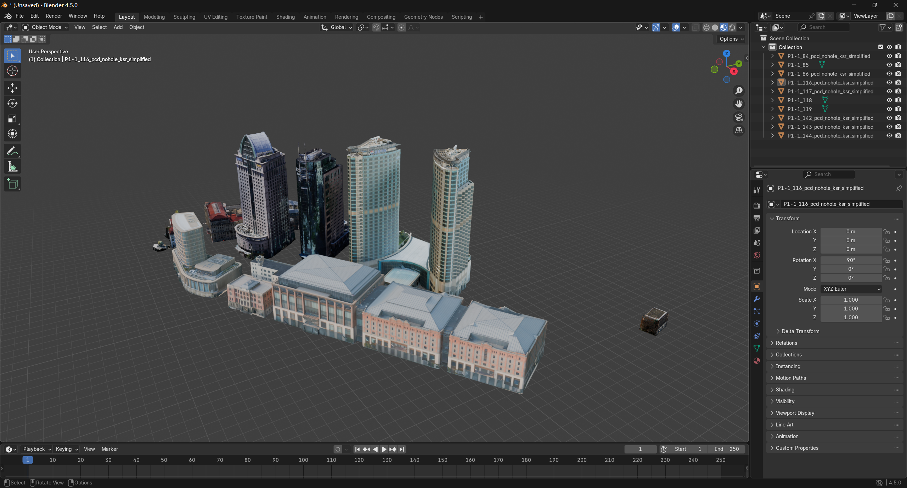
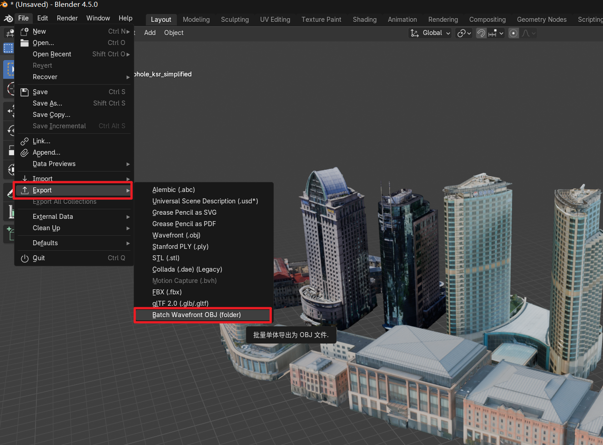
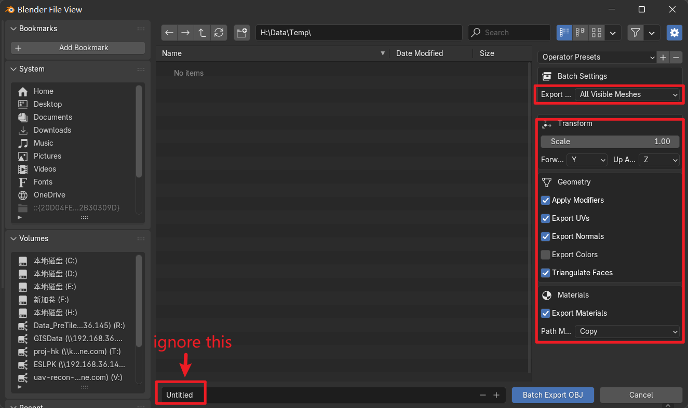
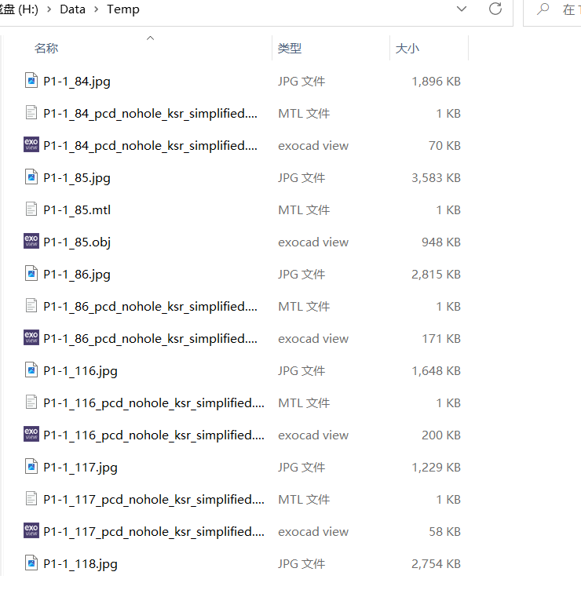

# 用法

Blender 4.x 插件，用于批量导入和导出 obj 模型，导出时会按每个对象单独导出

 

## 批量导入

1. 安装并激活插件 AL Batch OBJ Manager

2. 进入存放 .obj 模型的目录，调整参数之后点击 Batch Import OBJ，参数含义如下：
   1. Recursive --- 递归子目录，不勾选则只导入当前目录下的 .obj 模型，子目录及更深层目录不会被递归搜索。勾选时，可以通过 Max Depth 参数来设置最大递归层级数，当设置为 -1 表示无限递归子目录，即无论目录有多深都会进入查找是否存在 .obj 的模型文件。
   2. Transform、Forward Axis、Up Axis、Options 等参数都和导入单体 obj 时的参数一致，按数据和导入后的期待进行设置就行。

3. 导入后模型如下（不会修改渲染模式）

 

## 批量导出

1. 进入批量导出功能

2. 设置导出参数（一定会将每个单体模型都导出为单独的 .obj 模型），参数含义如下
   1. Export Range --- 切换导出所有可见模型，还是仅导出选中的模型。
   2. Transform、Geometry、Materials 等参数与单体导出 obj 时相同，按需设置即可。

3. 导出后的结果目录如下

